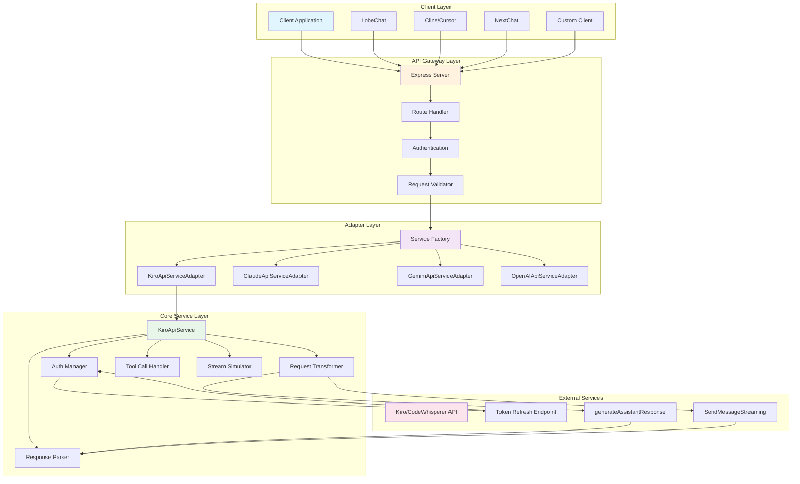
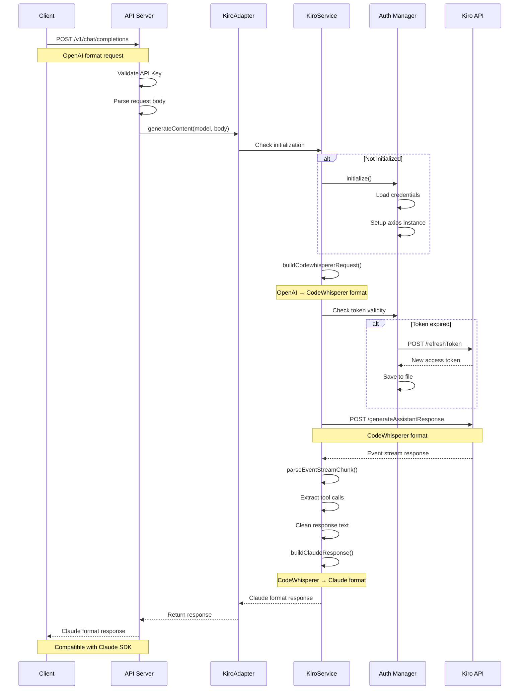
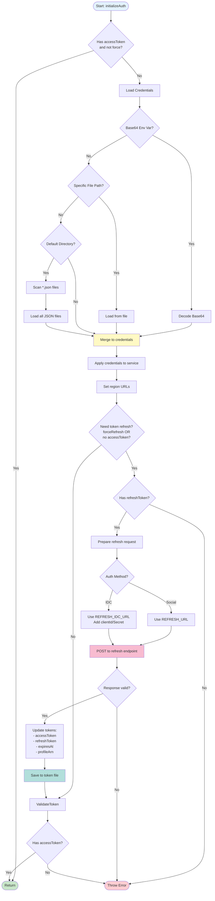
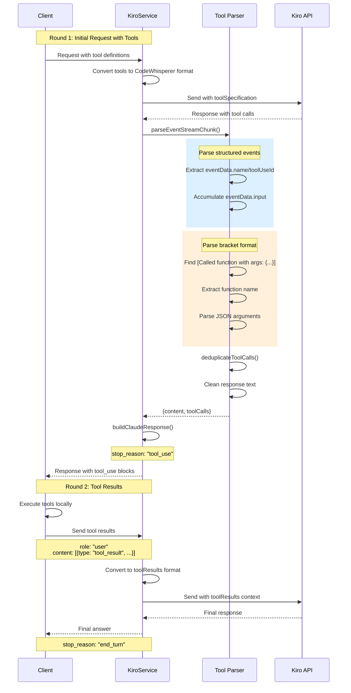
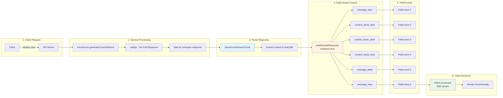
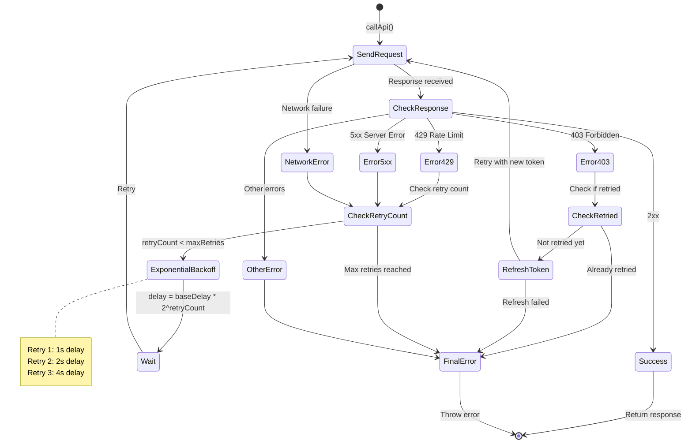
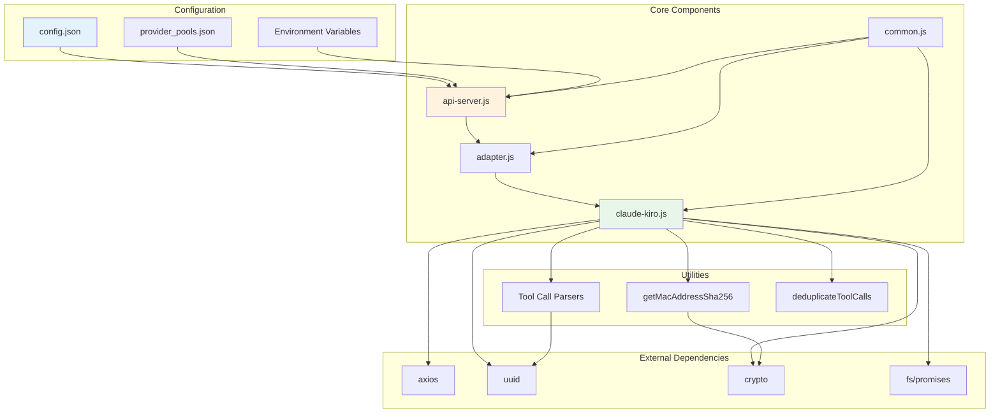
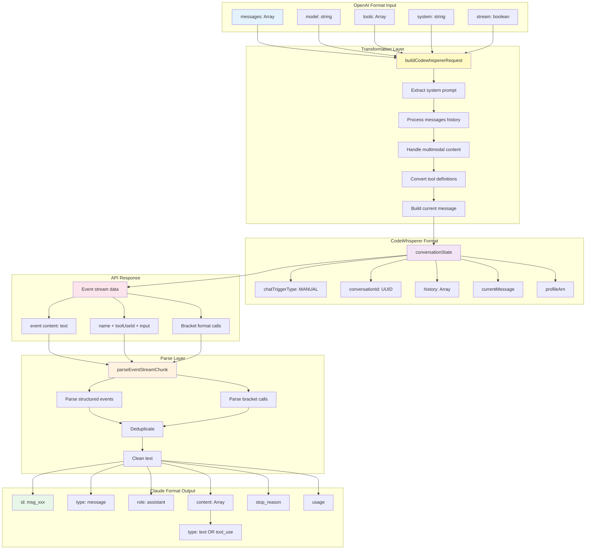
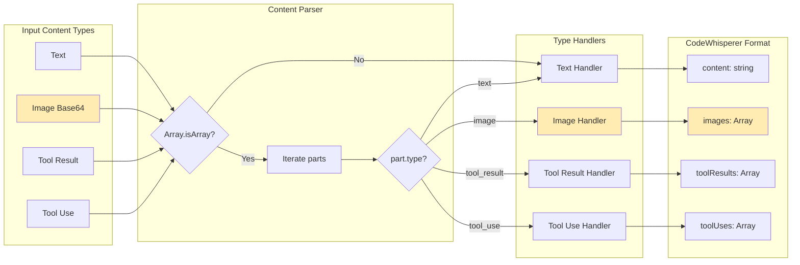
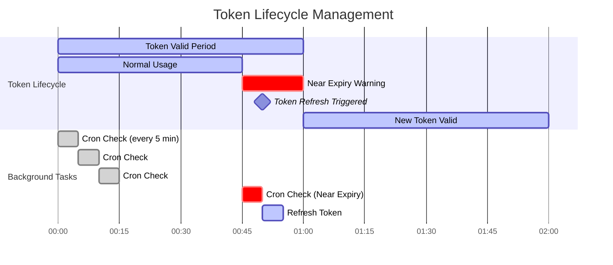

# Kiro Claude 架构图和流程图

本文档包含 Kiro Claude 实现的各种可视化图表，帮助理解系统架构和运行流程。

---

## 目录

- [整体系统架构](#整体系统架构)
- [请求处理流程](#请求处理流程)
- [认证流程详解](#认证流程详解)
- [工具调用序列](#工具调用序列)
- [流式响应流程](#流式响应流程)
- [错误处理和重试](#错误处理和重试)
- [组件依赖关系](#组件依赖关系)
- [数据转换流程](#数据转换流程)

---

## 整体系统架构



---

## 请求处理流程



---

## 认证流程详解



---

## 工具调用序列



---

## 流式响应流程



---

## 错误处理和重试



---

## 组件依赖关系



---

## 数据转换流程



---

## 多模态内容处理



---

## Token 生命周期管理



---

## 工具调用文本清理流程

```mermaid
flowchart TD
    A[Raw Response Text] --> B{Contains '[Called'?}
    
    B -->|No| Z[Return text as-is]
    B -->|Yes| C[parseBracketToolCalls]
    
    C --> D[Find all '[Called' positions]
    D --> E[For each position]
    
    E --> F[Find matching ']' bracket]
    F --> G[Extract tool call text]
    G --> H[Parse function name and args]
    H --> I[Create tool call object]
    
    I --> J[Add to toolCalls array]
    J --> K{More positions?}
    
    K -->|Yes| E
    K -->|No| L[Deduplicate tool calls]
    
    L --> M[For each tool call]
    M --> N[Build regex pattern]
    N --> O["Pattern: \[Called name with args: {...}\]"]
    
    O --> P[Replace in text with empty string]
    P --> Q{More tool calls?}
    
    Q -->|Yes| M
    Q -->|No| R[Clean whitespace]
    
    R --> S[Replace multiple spaces with single space]
    S --> T[Trim text]
    T --> Z[Return cleaned text + tool calls]
    
    style A fill:#e3f2fd
    style C fill:#fff3e0
    style L fill:#f8bbd0
    style R fill:#c8e6c9
    style Z fill:#a5d6a7
```

---

## 使用这些图表

所有图表使用 Mermaid 语法编写，可以在以下环境中渲染：

1. **GitHub**: 原生支持 Mermaid 图表
2. **VSCode**: 安装 Mermaid 预览插件
3. **在线编辑器**: https://mermaid.live/
4. **文档生成器**: Docusaurus, GitBook, MkDocs 等

### 在 Markdown 中使用

直接将 Mermaid 代码块嵌入到 Markdown 文件中：

\`\`\`mermaid
graph TD
    A[开始] --> B[结束]
\`\`\`

### 导出为图片

使用 Mermaid CLI 导出：

```bash
npm install -g @mermaid-js/mermaid-cli
mmdc -i KIRO_CLAUDE_DIAGRAMS.md -o output.png
```

---

**文档版本**: 1.0.0  
**最后更新**: 2025-02-07  
**维护者**: AIClient-2-API Team